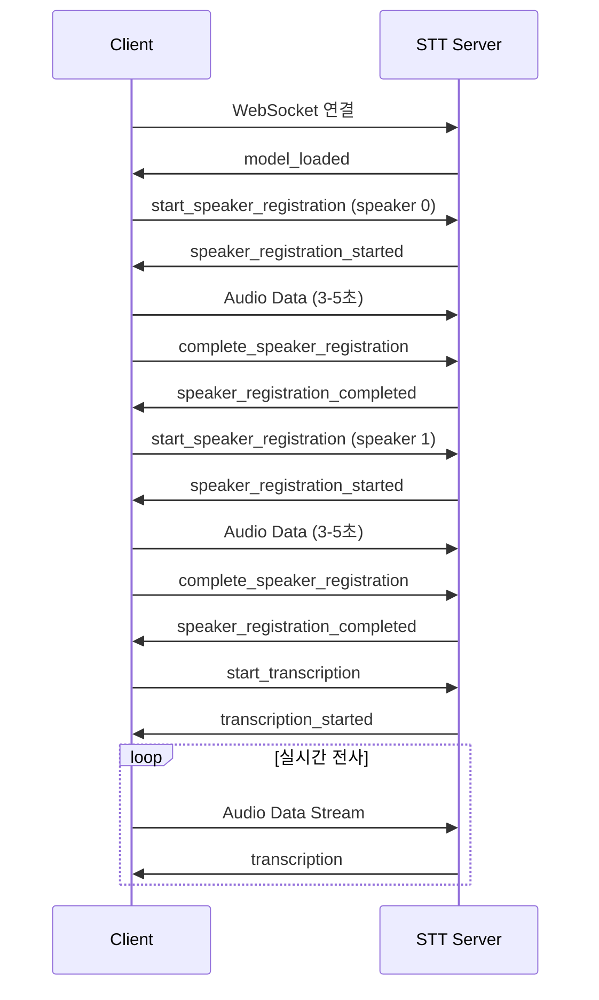

# 🔌 실시간 화자분리 STT API 명세서

## 개요

실시간 화자분리 STT 시스템의 WebSocket API 명세서입니다.

### 연결 정보
- **프로토콜**: WebSocket Secure (WSS)
- **엔드포인트**: `wss://safe-hi.xyz:8088`
- **인증**: SSL/TLS 인증서 기반

## 연결 흐름



## 메시지 형식

### 1. 연결 및 초기화

#### 1.1 모델 로드 완료 (서버 → 클라이언트)
```json
{
    "type": "model_loaded",
    "message": "STT AI 모델 로드 완료! 화자 등록을 시작하세요."
}
```

### 2. 화자 등록

#### 2.1 화자 등록 시작 (클라이언트 → 서버)
```json
{
    "type": "start_speaker_registration",
    "speaker_id": 0  // 0: 화자1, 1: 화자2
}
```

#### 2.2 화자 등록 시작됨 (서버 → 클라이언트)
```json
{
    "type": "speaker_registration_started",
    "speaker_id": 0,
    "message": "화자 1번의 목소리를 등록해주세요. (3-5초간 말씀해주세요)"
}
```

#### 2.3 화자 등록 완료 (클라이언트 → 서버)
```json
{
    "type": "complete_speaker_registration",
    "speaker_id": 0
}
```

#### 2.4 화자 등록 완료됨 (서버 → 클라이언트)
```json
{
    "type": "speaker_registration_completed",
    "speaker_id": 0,
    "message": "화자 1번 등록이 완료되었습니다."
}
```

### 3. 실시간 전사

#### 3.1 실시간 전사 시작 (클라이언트 → 서버)
```json
{
    "type": "start_transcription"
}
```

#### 3.2 실시간 전사 시작됨 (서버 → 클라이언트)
```json
{
    "type": "transcription_started",
    "message": "실시간 전사를 시작합니다."
}
```

#### 3.3 전사 결과 (서버 → 클라이언트)
```json
{
    "type": "transcription",
    "speaker_id": 0,                           // 화자 ID (0 또는 1)
    "text": "안녕하세요 반갑습니다",             // 전사된 텍스트
    "timestamp": "2025-08-21T05:30:15.123Z",   // ISO 8601 타임스탬프
    "confidence": -25.5                        // 음성 신뢰도 (dB, 선택적)
}
```

### 4. 오디오 데이터

#### 4.1 오디오 스트림 (클라이언트 → 서버)
- **형식**: Binary PCM16
- **샘플레이트**: 16kHz
- **채널**: 1 (모노)
- **비트 깊이**: 16bit
- **엔디안**: Little Endian
- **청크 크기**: 4096 samples (권장)

**JavaScript 예시**:
```javascript
// AudioContext에서 PCM16 변환
function convertToPCM16(float32Array) {
    const buffer = new ArrayBuffer(float32Array.length * 2);
    const view = new DataView(buffer);
    let offset = 0;
    
    for (let i = 0; i < float32Array.length; i++, offset += 2) {
        let s = Math.max(-1, Math.min(1, float32Array[i]));
        view.setInt16(offset, s < 0 ? s * 0x8000 : s * 0x7FFF, true);
    }
    
    return buffer;
}

// 전송
websocket.send(pcmData);
```

## 오류 처리

### 연결 오류
```json
{
    "type": "error",
    "code": "CONNECTION_FAILED",
    "message": "WebSocket 연결에 실패했습니다."
}
```

### 화자 등록 오류
```json
{
    "type": "error", 
    "code": "SPEAKER_REGISTRATION_FAILED",
    "speaker_id": 0,
    "message": "화자 등록에 실패했습니다. 다시 시도해주세요."
}
```

### 전사 오류
```json
{
    "type": "error",
    "code": "TRANSCRIPTION_FAILED", 
    "message": "음성 인식에 실패했습니다."
}
```

## 상태 코드

| 코드 | 의미 | 설명 |
|------|------|------|
| 1000 | Normal Closure | 정상 종료 |
| 1001 | Going Away | 클라이언트가 떠남 |
| 1002 | Protocol Error | 프로토콜 오류 |
| 1003 | Unsupported Data | 지원하지 않는 데이터 |
| 1011 | Internal Error | 서버 내부 오류 |

## 클라이언트 구현 예시

### JavaScript WebSocket 클라이언트
```javascript
class STTClient {
    constructor() {
        this.ws = new WebSocket('wss://safe-hi.xyz:8088');
        this.audioContext = null;
        this.mediaStream = null;
        
        this.ws.onopen = this.onOpen.bind(this);
        this.ws.onmessage = this.onMessage.bind(this);
        this.ws.onerror = this.onError.bind(this);
        this.ws.onclose = this.onClose.bind(this);
    }
    
    onOpen() {
        console.log('STT 서버 연결됨');
    }
    
    onMessage(event) {
        const data = JSON.parse(event.data);
        switch(data.type) {
            case 'model_loaded':
                console.log('모델 로드 완료');
                break;
            case 'transcription':
                this.displayTranscription(data);
                break;
        }
    }
    
    async startSpeakerRegistration(speakerId) {
        await this.setupAudio();
        this.ws.send(JSON.stringify({
            type: 'start_speaker_registration',
            speaker_id: speakerId
        }));
    }
    
    completeSpeakerRegistration(speakerId) {
        this.ws.send(JSON.stringify({
            type: 'complete_speaker_registration',
            speaker_id: speakerId
        }));
    }
    
    startTranscription() {
        this.ws.send(JSON.stringify({
            type: 'start_transcription'
        }));
    }
}
```

## 성능 최적화

### 권장 설정
- **청크 크기**: 4096 samples (약 256ms)
- **전송 빈도**: 초당 4회
- **버퍼 크기**: 최소 3개 청크

### 지연시간 최적화
- WebSocket 연결 유지
- 오디오 버퍼 최소화
- GPU 가속 사용

## 보안 고려사항

### SSL/TLS 설정
- TLS 1.2+ 필수
- 유효한 SSL 인증서 필요
- HTTPS에서만 마이크 접근 가능

### 데이터 보호
- 오디오 데이터는 실시간 처리 후 삭제
- 개인정보 로깅 금지
- 세션별 격리

## 제한사항

### 기술적 제한
- 최대 동시 연결: 10개
- 세션 타임아웃: 30분
- 최대 오디오 길이: 연속 10분

### 브라우저 호환성
- Chrome 80+
- Firefox 75+
- Safari 13+
- Edge 80+

## 테스트

### 연결 테스트
```bash
# WebSocket 연결 테스트
wscat -c wss://safe-hi.xyz:8088
```

### 부하 테스트
- 동시 연결 수: 10개
- 지속 시간: 10분
- 데이터 처리량: 128kbps per connection

---

**문서 버전**: 1.0  
**최종 업데이트**: 2025-08-21